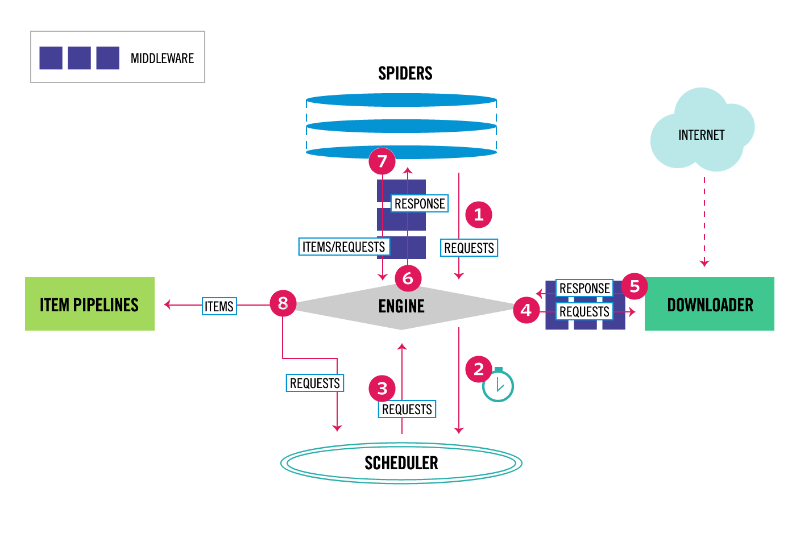

# Scrapy


**Scrapy** — это мощный фреймворк для веб-краулинга и веб-скрапинга на Python.
Он позволяет автоматически обходить сайты, делать HTTP-запросы, извлекать нужные данные и сохранять их в структурированном виде (например, JSON, CSV, БД).

В основе Scrapy — идея пауков (spiders) — самостоятельных объектов, которые получают страницы и описывают, что из них извлекать

Scrapy может выступать альтернативой связки BeautifulSoup + requests \ httpx или Selenium \ Playwright.

Scrapy по умолчанию работает асинхронно (через Twisted), поэтому при большом количестве запросов он быстрее простых скриптов на requests + BeautifulSoup.

Twisted — это асинхронный сетевой фреймворк для Python, предназначенный для написания программ, которые работают с сетью и I/O-операциями.


#### Когда стоит использовать

- нужен масштабный сбор данных с сайта или группы сайтов;
- нужно автоматически переходить по ссылкам (краулинг);
- нужна встроенная асинхронность и контроль очереди запросов;
- нужны встроенные возможности
  - выбор элементов по CSS / XPath,
  - пауки с правилами обхода,
  - pipeline для обработки/очистки/сохранения данных;
  - экспорт данных в форматы JSON/CSV и др.


#### Когда не стоит использовать

- Для сайтов с динамической загрузкой контента.
- Если нужно быстро собрать относительно небольшой объём данных. Тогда requests + BeautifulSoup будет проще и понятнее.
- Если разрабатываемый скрапер достаточно прост или нужен на один раз.


# Принцип работы



# Ссылки
- https://docs.scrapy.org/en/latest/intro/tutorial.html


# Структура проекта

Создание шаблона проекта
```bash
scrapy startproject myproject
cd myproject
```

Будут созданы папки и файлы
```
myproject/
  scrapy.cfg
  myproject/
    spiders/
    settings.py
    items.py
    pipelines.py
```


Пример простого скрапера simple_spider.py внутри папки myproject/spiders/
```py
import scrapy

class SimpleSpider(scrapy.Spider):
    name = "simple"                  # имя, по которому запускается паук;
    start_urls = ["https://quotes.toscrape.com/"]  # сайт для примера

    # метод, куда Scrapy передает ответ и где мы извлекаем данные.
    def parse(self, response):
        # собираем все цитаты на странице
        for quote in response.css("div.quote"):
            yield {
                "text": quote.css("span.text::text").get(),
                "author": quote.css("small.author::text").get(),
            }
```


Запуск паука
```bash
scrapy crawl simple

# запуск с сохранением данных в файл
scrapy crawl simple -o output.csv
```


См. параметры работы скрапера в файле `settings.py`.
