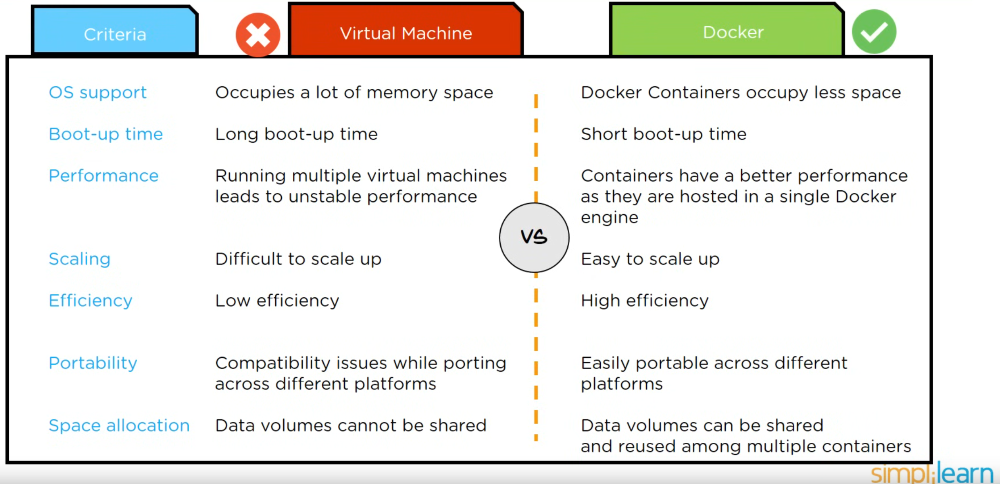

**Гипервизор** (монитор виртуальных машин) — программа (~ минимальная ОС) или аппаратная схема, обеспечивающая или позволяющая одновременное, параллельное выполнение нескольких *операционных систем* на одном и том же хост-компьютере. Гипервизор управляет доступом к ресурсам, обменом данных и изоляцией ОС. 


**Docker** — легковесная stateless (не сохраняющая состояния) виртуальная машина, работающая без гипервизора, на которой запускают обычно один или реже несколько процессов. С точки зрения процесса он является единственным, кто выполняется в ОС. Аппаратная среда не виртуализируется.




Docker, containerd — самые популярные Container Engine.


**Контейнер** — изолированная программная среда для выполнения приложения.

Контейнеры полезны в том числе для тестирования приложений в изолированной, всегда одинаковой и настроенной среде.

**Образ** — дистрибутив контейнера. Обычно включает в себя само приложение, необходимые файлы и библиотеки.


**Установка в Ubuntu**

```bash
 sudo apt-get install docker-ce docker-ce-cli containerd.io
```
Пакет `docker` — про другой docker

 https://docs.docker.com/engine/install/ubuntu/


Чтобы докер не требовал права рута для каждой операции нужно добавить текущего пользователя в группу
```bash
sudo groupadd docker   # если группа не создана

sudo usermod -aG docker $USER
```

<br>

## Hello World
**Создание образов**
1. Создать в отдельном каталоге файл dockerfile c описанием образа
 ```dockerfile
 FROM alpine                        # базовый образ для создания окружения
 # команда (программа), запускаемая при создании контейнера (запуске образа)
 CMD echo 'hello, World!'           
 ```

 alpine — Минимальная реализацию линукса.
 

 **контейнер** — запущенный образ

2. Создать образ
 ```bash
 docker build -t <имя_образа> <путь к каталогу c dockerfile>
 ```

3. Посмотреть на созданные в системе образы
```bash
docker images
```

4. Запустить образ
```bash
docker run <имя_образа>
```

<br>

## Операции

**список образов**\
`docker images`

**список контейнеров**
```bash
docker ps

# об использовании ресурсов контейнерами
docker stats
```

**создание контейнера**\
`docker build -t <имя_образа> <путь к каталогу c dockerfile>`

**сохранение\загрузка в отдельный файл**\
`docker save -o <path for generated tar file> <image name>`

При сохранении образ не сжимается, поэтому лучше так
`docker save <image-name> | bzip2 -z --best > <image-name.bz2>`

`docker load -i <path to image tar file>`

**Запуск образа**

```bash
docker run <image>
```
Если в докерфайле не описано никакой команды, то её можно запустить так:
```bash
docker run <image> [my_cmd]
```
Контейнер работает до тех пор, пока работает хоты бы один не фоновый процесс.

Костыль, для запуска фонового процесса в докере:
```bash
docker run <image> sh -c "my_background_program && while [[ 1 ]]; do echo 1; sleep 1s; done"
```
`sh -c "cmd1 && cmd"` — запускает *несколько команд; команды разделяются &&*;
Если записать последний аргумент без sh, то он будет восприниматься именем программы.\
Если без кавычек, то вторая часть команды будет восприянята не как команда контейнера, а как команда основной ОС.

**Задать имя контейнеру**
Задавать имя полезно, если команда длинная, содержит много параметров
```bash
docker run [params] --name <cont_name> <image_name>
```
`cont_name` — имя контейнера. 

После того, как им задано можно запускать контейнер используя его, с помощью команды `start`:
```bash
docker start <cont_name>
```

**Запустить образ и сразу войти в bash внутри образа**

```bash
docker run -it <image> bash
```
`-t` — подключить терминал \
`-i` — транслировать stdin текущего терминала в контейнер


**присоединиться к контейнеру** в интерактивном режиме, с вызовом bash

```python
docker exec -it <my-container> bash
```


Запустить в режиме демона\
`docker run -d  <my-container>`

Пр обычном запуске вывод контейнера идёт в stdout

`docker stop <my-container>` — остановка контейнера

<br>

## Доступ к контейнеру из ОС и из контейнера к ОС

**проброс портов** для доступа внутрь контейнера

Проброс портов нужно делать при запуске образа (например nginx)\
```docker run -p <external-port>:<cont-port> nginx```

external-port — порт на машине, где запускается контейнер

cont-port — порт внутри контейнера, на котором что-то работает

<br>

**передача параметров среды окружения** внутрь контейнера при запуске\
`docker run -e MY_VAR=value <my-container>

Копирование файлов в\из контейнера
`docker cp foo.txt mycontainer:/foo.txt`

`docker cp filename.txt CONTAINER:/app/my_file.txt`

После остановки контейнера все созданные данные удаляются.\
К контейнеру можно подключить внешние каталоги [ [doc](https://docs.docker.com/storage/bind-mounts/) ]\
`docker run -v "<внешняя папка>:<папка внутри контейнера для монтирования>" имя образа`

Кавычки нужны на случай пробелов в путях

## Dockerfile
`FROM` — задаёт базовый (родительский) образ.\
`LABEL` — описывает метаданные. Например — сведения о том, кто создал и поддерживает образ.\
`ENV` — устанавливает постоянные переменные среды.\
`RUN` — выполняет команду и создаёт слой образа. Используется для установки в контейнер пакетов.\
`COPY <from> <to>` — копирует в контейнер файлы и папки\
`ADD` — копирует файлы и папки в контейнер, может распаковывать локальные .tar-файлы\
`CMD` — описывает команду с аргументами, которую нужно выполнить когда контейнер будет запущен. Аргументы могут быть переопределены при запуске контейнера. В файле может присутствовать лишь одна инструкция CMD.\
`WORKDIR` — задаёт рабочую директорию для следующей инструкции.\
`ARG` — задаёт переменные для передачи Docker во время сборки образа.\
`ENTRYPOINT` — предоставляет команду с аргументами для вызова во время выполнения контейнера. Аргументы не переопределяются.\
`EXPOSE` — указывает на необходимость открыть порт.\
`VOLUME` — создаёт точку монтирования для работы с постоянным хранилищем.


 **Удалить все служебные файлы, созданные при apt upadate**
 ```rm -rf /var/lib/apt/lists/*```

<br>

## Docker registry — хранилище репозиториев
https://hub.docker.com/ — репозиторий с образами

Залогинится в docker hub
`docker login`

Скачать образ:\
`docker pull <имя образа>`

Загрузить образ
`docker push <имяпользователя>/<имя-образа>`

Перед загрузкой придётся переименовать образ, чтобы его имя содержало имя пользователя docker hub
`docker tab <old-name> <new-name>`

Образы загружаются всегда в приватный репозиторий. Сделать его публичным можно на docker hub


 #### Некоторые образы
 В названии образов часто есть суффиксы их характеризующие
 - alpine — на основе Alpine Linux; это ОС для контейнеров; маленький размер
 - slim — минимальный набор компонентов (но обычно больше чем Alpine)
 - [Debian](https://hub.docker.com/_/debian): 12 — Bookworm (2023), 11 — bullseye (2021); 10 ( buster );  9 ( stretch );  8 ( jessie ) [список версий debian](https://en.wikipedia.org/wiki/Debian_version_history)


## Безопасность
Докер запускается от рута.\
Поэтому запущенные им контейнеры могут иметь рутовый доступ ко всем подключенным внешним папкам.\

Хорошая практика — создавать в контейнере отдельного пользователя без прав суперадмина
```dockerfile
RUN useradd -ms /bin/bash app
# создание нового пользователя
# -m — создать home folder
# -s — задать оболочку командной строки
# app — имя пользователя
USER app
# переключение на пользователя
```


## Docker Compose
Compose — инструмент для создания и запуска многоконтейнерных Docker приложений.

Использование Compose обычно разделяется на три этапа:
1. Определение окружения вашего приложения в Dockerfile, это можно сделать в любом месте.
2. Определение сервисов из которых будет состоять ваше приложение в docker-compose.yml, в последствии они смогут быть запущены все вместе в изолированном окружении.
3. И наконец, выполнение команды docker-compose up которая запустит все ваше приложение.


# См. также
- podman - более легковесная OpenSource альтернатива Докеру

 # Ссылки
 - https://habr.com/ru/company/ruvds/blog/439980/
 - https://docs.google.com/presentation/d/1imKaYq3I1Vdtku0dS3m6ckFs9_6GzuNZ-y6h-GZ7wv8/edit#slide=id.gc13edb839a_0_33
 - https://hub.docker.com/ — репозиторий с образами
 - https://habr.com/ru/company/ruvds/blog/485650/ — Методики уменьшения размеров образов Docker
