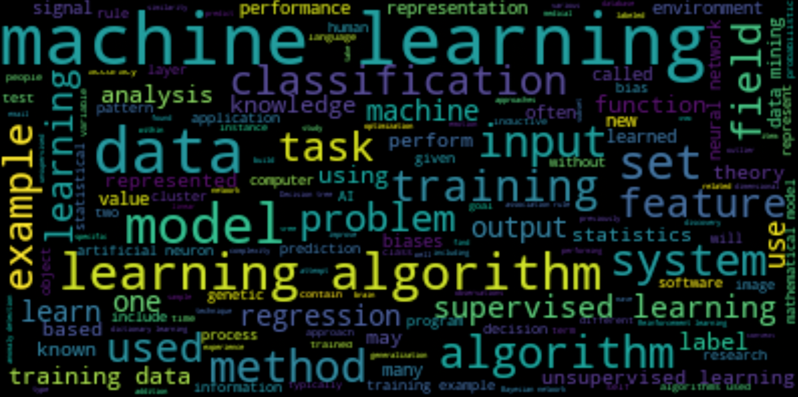

# Шпаргалка для предварительной обработки текстов

Часто используемые библиотеки и функции

```python
import nltk                                              # Natural Language Toolkit: https://www.nltk.org/
from nltk.corpus import stopwords                        # "мусорные" слова (стоп-слова): предлоги, союзы, часто используемые слова ...
from nltk.stem import PorterStemmer, SnowballStemmer     # приводить разные формы одного слова к одной
from nltk.tokenize import word_tokenize                  # разделять текст на слова

from nltk import ngrams, FreqDist                        # подсчитывать частоты слов
import string                                            # string.punctuation -- символы пунктуации
from wordcloud import WordCloud                          # рисовать облако из слов

nltk.download('stopwords')
nltk.download('punkt')
nltk.download('wordnet')   # для лемматизации
```

# Представление текста
- bag of words. текст -- сумма частот слов
- TfiDf
- векторное представление слов
- ...

# Предварительный анализ текста
## Анализ частот n-грамм
  ```python
  from nltk import ngrams, FreqDist
  drug_freq = FreqDist( text )
  ```
Возвращает список из пар (n-грамма, частота). Например: ```[('Birth Control', 7433), ('Depression', 2609), ('Pain', 1833),```

Облако слов
```python
wordcloud = WordCloud(stopwords = my_stop_words, width = 800, height = 600).generate(text)
plt.figure(figsize = (15, 10))
plt.imshow(wordcloud)
plt.axis("off")
plt.show()
```


# Пословарная обработка текста
0. Предварительный анализ
  - все ли текстовые данные заполнены
  - есть ли в тексте следы неправиного скрейпинга: html тэги, ссылки, html коды символов, ...
1. Разбить на слова
  ```python
  words = word_tokenize( text )
  ```
  - Удалить часто встречающиеся слова, которые часто не содержат много значимой информации
  ```python
  stop_words = set(stopwords.words('english'))  # загрузка множества стоп-слов. включая Not
  ```
2. Нормализация
  - Нижний регистр
  - Стемминг -- приведение слова к некоторой основе, не обязательно совпадающей с корнем
    - Стемминг с учётом части слова (part of speech)
  - Лемматизация -- приведение слова к лемме, некой нормальной форме. Например для существительных -- к именительному падежу, единственному числу.
    - Лемматизаторы для хорошего анализа часто требуют предложения целиком
  ```python
  stemmer = SnowballStemmer('english')  # простой стеммер, без учёта части речи
  stemmer.stem( 'word' )

  lemmatizer = nltk.WordNetLemmatizer() # простой лемматайзер, без учёта части речи
  lemmatizer.lemmatize( 'word' )
  ```
