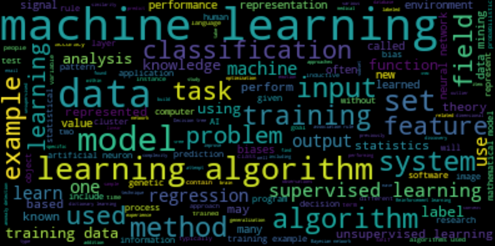

# Шпаргалка для предварительной обработки текстов

Часто используемые библиотеки и функции

```python
import nltk                                              # Natural Language Toolkit: https://www.nltk.org/
from nltk.corpus import stopwords                        # "мусорные" слова (стоп-слова): предлоги, союзы, часто используемые слова ...
from nltk.stem import PorterStemmer, SnowballStemmer     # приводить разные формы одного слова к одной
from nltk.tokenize import word_tokenize                  # разделять текст на слова

from nltk import ngrams, FreqDist                        # подсчитывать частоты слов
import string                                            # string.punctuation — символы пунктуации
from wordcloud import WordCloud                          # рисовать облако из слов

nltk.download('stopwords')
nltk.download('punkt')
nltk.download('wordnet')   # для лемматизации
```

# Представление текста
- bag of words. текст — сумма частот слов
- TfiDf
- векторное представление слов (word2vec и др.)
- ...

# Предварительный анализ текста
## Анализ частот n-грамм
  ```python
  from nltk import ngrams, FreqDist
  drug_freq = FreqDist( words_list )

  # построить график 50 самых частых слов
  drug_freq.plot(50)
  ```
Возвращает список из пар (n-грамма, частота). Например: ```[('Birth Control', 7433), ('Depression', 2609), ('Pain', 1833),```

Облако слов
```python
wordcloud = WordCloud(stopwords = my_stop_words, width = 800, height = 600).generate(text)
plt.figure(figsize = (15, 10))
plt.imshow(wordcloud)
plt.axis("off")
plt.show()
```


# Пословарная обработка текста
0. Предварительный анализ
  - все ли текстовые данные заполнены
  - есть ли в тексте следы неправильного скрейпинга: html тэги, ссылки, html коды символов, ...
1. Разбить на слова
  ```python
  words = word_tokenize( text )
  ```
  - Удалить часто встречающиеся слова, которые часто не содержат много значимой информации
  ```python
  stop_words = set(stopwords.words('english'))  # загрузка множества стоп-слов. включая Not
  ```
2. Нормализация
  - Нижний регистр
  - Стемминг — приведение слова к некоторой основе, не обязательно совпадающей с корнем
    - Стемминг с учётом части слова (part of speech)
  - Лемматизация — приведение слова к лемме, некой нормальной форме. Например для существительных — к именительному падежу, единственному числу.
    - Лемматизаторы для хорошего анализа часто требуют предложения целиком
  ```python
  stemmer = SnowballStemmer('english')  # простой стеммер, без учёта части речи
  stemmer.stem( 'word' )

  lemmatizer = nltk.WordNetLemmatizer() # простой лемматайзер, без учёта части речи
  lemmatizer.lemmatize( 'word' )
  ```
  
## Пример
  - https://colab.research.google.com/drive/1yOnvYUbbu7b2sgnh4vn1csis9PWAss_f?usp=sharing — предобработка (удаление лишних слов, стемминг), TF-IDF кодирование, предсказание с помощью SVM

# Кодирование TF-IDF
```python
from sklearn.feature_extraction.text import TfidfVectorizer

# https://scikit-learn.org/stable/modules/generated/sklearn.feature_extraction.text.TfidfVectorizer.html
tf_idf = TfidfVectorizer(
    ngram_range=(1, 1),             # рассматриваем только 1-граммы, т.е. отдельные слова; можно рассматривать слова и словосочетания (1,2) и т.д.
    max_df=0.8,                     # слова, встречаемые более чем в 80% документов будут отброшены
    min_df=10,                      # мин. частота слова в текстах (более редкие слова игнорируются)
    stop_words = list(Stopwords),
    # max_features =                # можно задать максимальное количество рассматриваемых слов, иначе будут рассмотренны все
    # vocabulary =                  # задать словарь вручную
    # preprocess =                  #
)

# TfidfVectorizer тоже умеет делать предобработку: preprocessor=None, tokenizer=None, stop_words=None, token_pattern='(?u)\\b\\w\\w+\\b',  ...
# analyzer{‘word’, ‘char’, ‘char_wb’} or callable, default=’word’ -- можно анализировать не только слова

# max_features=None, vocabulary=None, binary=False, dtype=np.float64, norm='l2', use_idf=True, smooth_idf=True, sublinear_tf=False)
# получим sparse (разреженную) матрицу, где сторки по-прежнему документы, столбцы -- токены (слова)
X = tf_idf.fit_transform( <итерируемый набор текстов> )

tf_idf.idf_         # вектор весов слов, в зависимости от их встречаемости в документах


tfidf.vocabulary_   # словарь (слово, номер)
```

## Пример
  - https://colab.research.google.com/drive/1yOnvYUbbu7b2sgnh4vn1csis9PWAss_f?usp=sharing — предобработка (удаление лишних слов, стемминг), TF-IDF кодирование, предсказание с помощью SVM


# Тексты в PyTorch
**Токенизация**
```python
from torchtext.data.utils import get_tokenizer    

# делает ловеркейс, разбивает на токены (в том числе знаки препинания),
# вместо первого параметра можно передать свою функцию
tokenizer = get_tokenizer('basic_english')


tokens = tokenizer('Hello, World!')   # ->  ['hello', ',', 'world', '!']
```

Составление словаря
```python
from torchtext.vocab import Vocab                       # класс Словарь
from torchtext.vocab import build_vocab_from_iterator   # создаёт словарь Vocab, мэпит слова в числа

def get_tokens(dataset):
    """генератор: выдаёт весь датасет по частям (текстам) в виде списка токенов (слов)
    dataset — набор текстов"""
    for text in dataset:        
        yield [ w for w in tokenizer(text) ] 

# my_dataset = [ 'Hello, World! Hello, Pytorch',
                  'lorem ipusm...'
                  ]
vocab = build_vocab_from_iterator(get_tokens(my_dataset), specials=["<unk>", "<pad>"])
# vocab['<unk>'] -> 0     
# vocab['<pad>'] -> 1   # для забивки коротких текстов до нужной длины
# vocab['hello'] -> 42
...

# пример замены по словарю
tokens = tokenizer('Remember, remember, the 5th of November, Gunpowder, treason and plot.')
vocab( tokens )     # ->  [374, 4, 374, 4, 2, 9750, 7, 10167, 4, 21199, 4, 16087, 5, 122, 3]
```

# Некоторые пакеты для работы с текстом
- NLTK, spaCy
- sentence embeddings - пакет от HugginFace для создания эмбеддингов текстов (с помощью моделей на оснвое BERT)
- BERTtopic - фреимворк для тематического моделирования (короткая спарвка: NLP_topic_modeling.md)
- LangChain - фреимворк для построения создания пайплайнов (цепочек) обработки текста в приложениях

# Ссылки
1.Примеры с новым API для работы с текстами:\
    https://colab.research.google.com/github/pytorch/text/blob/master/examples/legacy_tutorial/migration_tutorial.ipynb#scrollTo=Ro8HXPwmwtp7
2. Проект Natasha — набор Python-библиотек для обработки текстов на естественном русском языке\
    https://natasha.github.io/
