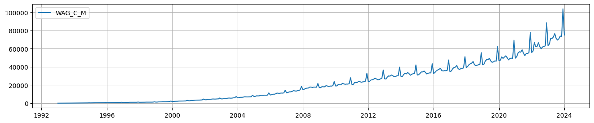

# Анализ и прогнозирование временных рядов

Пример: https://colab.research.google.com/drive/1ZOOJK2-9mYED6WiMRnFAe74miSfjKHxG#scrollTo=fUyFk2VCuMGt

#### Визуализация компонент временного ряда

```python
# статистическая библиотека 
import statsmodels.api as sm            # https://pypi.org/project/statsmodels/ 

# разложение временного ряда на компоненты: 
_ = sm.tsa.seasonal_decompose( <data> ).plot()
```

# Некоторые датасеты
### Модельный датасет Bike Sharing Demand
```python
from sklearn.datasets import fetch_openml
bike_sharing = fetch_openml("Bike_Sharing_Demand", version=2, as_frame=True) 
```


### Заработная плата в России
http://sophist.hse.ru/hse/1/tables/WAG_M.htm - единый архив экономических социологических данных (ВШЭ)
```python
data0 = pd.read_html('http://sophist.hse.ru/hse/1/tables/WAG_M.htm',           
                    header=0,
                    decimal=',', thousands='.',                                 # по-умолчанию точки и запятые имеют обратный смысл
                    skiprows=[1])[0]     
```


# Ссылки
https://education.yandex.ru/handbook/ml/article/vremennye-ryady