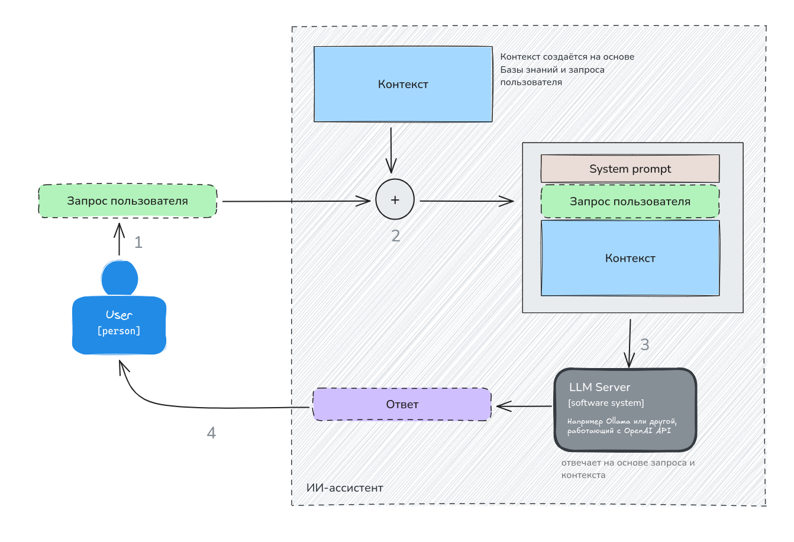
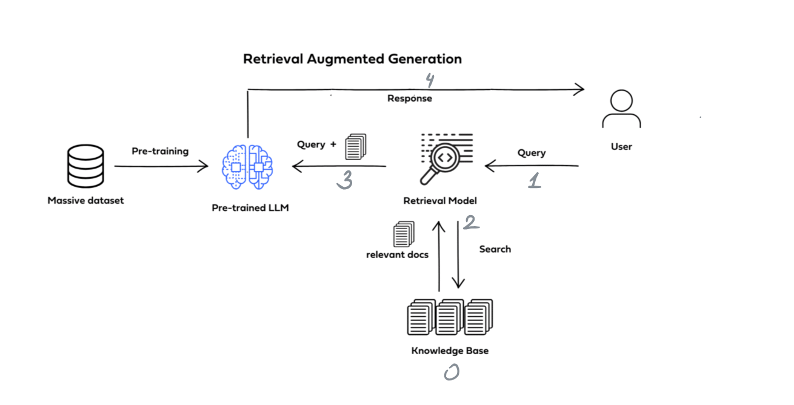
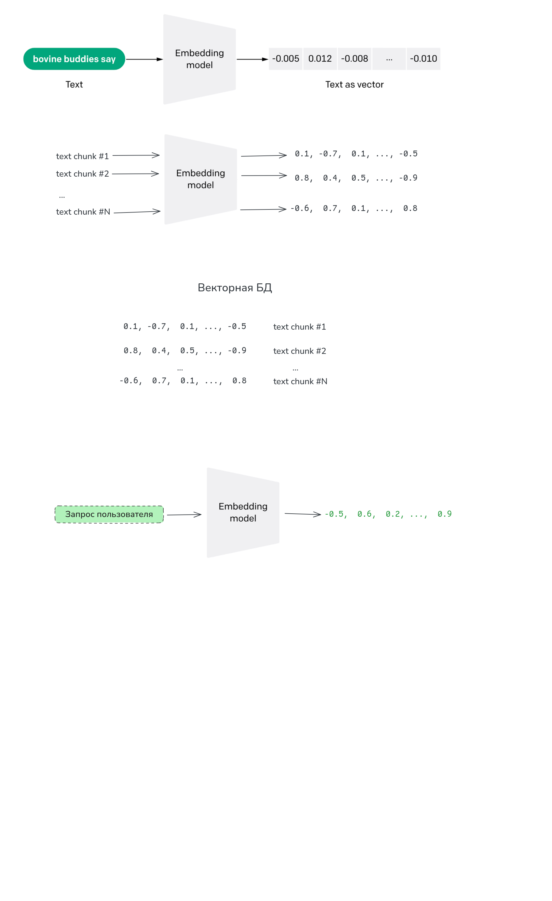
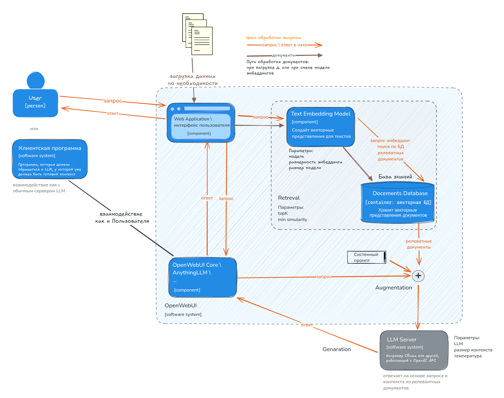

# **Retrieval-Augmented Generation** 

Retrieval-Augmented Generation (RAG) — подход, при котором языковая модель генерирует ответы, опираясь не только на собственные знания полученные в процессе обучения, но и на найденные по запросу фрагменты из внешней базы знаний (документы, база статей, корпоративный wiki и т.п.).​

RAG – частный случай использования внешней для LLM информации. 

| Подход | Источник знаний | Сложность внедрения | Масштаб по количеству документов | Актуальность/обновляемость | Когда уместен |
| :---- | :---- | :---- | :---- | :---- | :---- |
| **Обычный чат** | Встроенные знания модели | Низкая | Не применимо | Фиксируется при обучении | Общие вопросы, использование режима размышлений |
| **Чат с одним документом** | Один/несколько загруженных файлов | Низкая | Малое количество, помещается в контекст | Обновление \= перезагрузка документа | Разбор статьи, договора, отчета |
| **Модель с длинным контекстом** | Документы, помещаемые прямо в запрос | Средняя | Ограничен длиной контекста | Зависит от того, что подано в запрос | Глубокий анализ одного/нескольких документов |
| **Веб-поиск (Perplexity или плагины для LM Studio и т.п.)** | Интернет, открытые источники | Средняя (настройка API) | Ограничен интернетом, не вашей базой | Высокая для публичной информации | Новости, общие факты, справочные вопросы |
| **Fine-tuning (дообучение) без RAG** | Встроенные знания модели \+ знания предметной области | Высокая | Знания «зашиты» в модель | Плохо обновляемы | Стандартизированные сценарии, стиль ответов |
| **RAG по своей базе** | Корпоративные/личные документы | Средняя/высокая | Высокий, большое число документов | Высокая при грамотном обновлении | Внутренние ассистенты, база знаний, техподдержка |

## **Идея**

RAG работает во время чата с моделью и при каждом запросе выполняются действия:  
1\. поиск (**retrieval**) информации связанной с запросом в специальной базе данных; этап 2 на рисунке ниже.

2\. дополненное запроса найденной информацией (**augmentation**); этап 3 на рисунке ниже.

3\. генерация (**generation**) ответа на основе запроса и найденной информации. этап 4 на рисунке ниже

Для этого предварительно строится база данных (БД). В неё загружаются все необходимые документы. Документы разбиваются на фрагменты (чанки, chanks), каждому фрагменту строится векторное представление (эмбеддинг) текста и сохраняется в БД. Такая БД с технической точки зрения называется ***векторной базой данных***. С точки зрения назначения базу данных можно называть ***базой знаний (knowledge base)***.

Векторное представление текста создаётся специальной не генеративной языковой моделью – **моделью эмбеддингов**. А сам вектор понятном для нейросети образом кодирует смысл текста. **Моделью эмбеддингов –** это ключевой компонент для модели извлечения (retrieval model).

**Этап 1 – поиск (retrieval)** работает так:

1. По пользовательскому запросу (промпту) создаётся вектор (эмбеддинг) с помошью модели эмбеддингов.  
2. По этому вектору ищутся близкие вектора в БД. Задача поиска записи в БД, связанной с запросом реализуется гораздо проще если сравнивать эмбеддинги текстов а не сами тексты.  
3. Их найденных записей выбирается наиболее близкие по смыслу. Если таких много, то их количество дополнительно ограничивается. 

### Плюсы подхода RAG

* Не нужно дополнительно обучать LLM. Так как в неё будет подаваться актуальная и специально отобранная информация вместе с запросом.  
* Актуальность знаний. База знаний может обновляться отдельно от модели, без переобучения.​  
* Масштабируемость по данным. Можно подключать большое количество документов и других текстовых материалов, не встраивая их в параметры модели.​  
* Управляемость. Можно точно задать, из каких документов система имеет право брать факты (регламенты, внутренние инструкции, база FAQ).​  
* Снижение галлюцинаций. При грамотной настройке этапа Retrieval и инструкций модель реже галлюцинирует.  
* Прозрачность. Можно показывать пользователю ссылки на источники, которым пользовалась модель при ответе.​

Для бизнеса это означает возможность сделать «умного ассистента», который отвечает именно документам компании: договорам, инструкциям, регламентам, политике компании и т.д. А отдельные пользователи могут использовать чат со своей персональной базу знаний, заметками и т.п.

### Минусы и ограничения RAG

* Зависимость от качества поиска. Если retrieval подобрал нерелевантные чанки, модель будет строить ответ на неверном контексте.​  
* Чувствительность к качеству разметки документов. При плохом разбиении PDF/HTML теряется структура, таблицы и связи между частями текста; это ухудшает ответы.​  
* Ограничение по длине контекста (иногда). Для LLM обычно задаётся сравнительно небольшой допустимый размер контекстного окна, поэтому нельзя просто подставить много фрагментов текста (чанков); приходится жёстко выбирать небольшое число фрагментов.​  
* Дополнительная программная инфраструктура. Нужна векторная база, инструменты для её создания и обновления, обновления, мониторинга качества и пр.​ Нужен подходящий сервер или компьютер.  
* Не *гарантии* отсутствия галлюцинаций. Модель может игнорировать контекст, выдумывать связи или интерпретации, особенно при сложных или двусмысленных запросах.​

Также RAG может работать плохо, если:

* Вопрос требует логики, а не фактов (например, сложная дедукция, математическое доказательство).​ Но тут многое зависит от LLM.  
* Документы противоречат друг другу, а система не умеет решать конфликты источников.​

#### Не всегда имеет смысл делать RAG

* Если весь нужный документ легко помещается в контекст модели, можно обойтись простым чатом с документом.​  
* Если задача — общий разговор без привязки к базе знаний, достаточно «обычного» чата.

## **Программы для построения RAG**

Схема работы программ

* **AnythingLLM**  
  Простая установка. Можно скачивать и использовать LLM и модели эмбеддингов прямо в программе. Можно использовать сторонних провайдеров для этих моделей, в том числе ollama и LM Studio.   
* GPT4all. [nomic.ai/gpt4all](https://www.nomic.ai/gpt4all).   
* Open WebUI  
* [Jan.ai](http://Jan.ai)

# **Для разработчиков**

## **Библиотеки для работы с RAG на Python**

**Пакеты LangChain**  
Есть версии для Python и других языков программирования. API библиотеки меняется, поэтому многие старые примеры кода могут не работать.

* langchain – ядро фреймворка: цепочки, RAG-конвейеры, Memory, Tools.​  
* langchain-core – базовые протоколы и абстракции (Runnable, messages и т.п.).​  
* langchain-community – коннекторы к векторным БД, сторонним LLM, инструментам и пр.​  
* langchain-openai – отдельные классы для работы с OpenAI/Compatible API.​  
* langgraph – надстройка для построения графов/агентов поверх LangChain (часто применяют в сложных RAG‑схемах)

**Пакеты LlamaIndex**

* llama-index (раньше gpt\_index) – базовый пакет, высокоуровневый фреймворк для RAG (индексы, query engine, retrievers).​  
* llama-index-core – ядро, типы индексов и запросов.​  
* llama-index-llms-\* – адаптеры LLM (например, llama-index-llms-openai, llama-index-llms-anthropic).​  
* llama-index-embeddings-\* – адаптеры эмбеддингов (OpenAI, HuggingFace, Cohere и др.).​  
* llama-index-vector-stores-\* – интеграции с Chroma, Qdrant, Milvus, Weaviate и т.д

**GigaChain** – аналог GigaChain от Сбер.

**Haystack**

**txtai**

**RAGFlow**

## **Для работы с эмбеддингами**

**sentence-transformers** – де\-факто стандарт для локальных эмбеддингов (BERT/RoBERTa/bge и др.).​

**GigaEmbeddings**

**FlagEmbedding** – семейство bge-\* и других современных моделей эмбеддингов, часто используемых в RAG.​

**openai** – клиент для OpenAI, включает создание эмбеддингов (например, text-embedding-3-\*).​

**Cohere, Voyage и др. –** свои Python SDK с API для эмбеддингов, но уже менее универсальные

### Мультимодальные эмбеддинги

**CLIP / OpenCLIP** (через OpenAI, sentence-transformers или отдельные репозитории) – для текст+картинки.​

**HuggingFace transformers** – можно напрямую использовать модели для получения эмбеддингов.​

**vectordbs** – универсальная библиотека для доступа к разным векторным хранилищам из Python

## **Векторные базы для Python**

### Локальные/встроенные

**chromadb** – популярная локальная векторная БД; простой Python‑API, часто используется в туториалах по RAG.​

**faiss** – библиотека от F\*\*\*\*\*

### Другие

pinecone-client – облачная векторная БД; часто используется в RAG-примерах с LangChain/LlamaIndex.​

## **Клиенты LLM**

### Локальные LLM

ollama – Python-клиент к локальному серверу Ollama, который запускает модели (Llama, Mistral и др.)​

llama-cpp-python – привязка к llama.cpp; можно запускать GGUF‑модели локально.​

vllm – сервер и библиотека для высокопроизводительного инференса LLM (GPU).​

### Универсальные клиенты

litellm – единый API для множества провайдеров (OpenAI, Anthropic, Ollama и др.).​

langchain-openai, langchain-anthropic, langchain-ollama – адаптеры в экосистеме LangChain для разных LLM.
