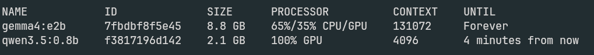
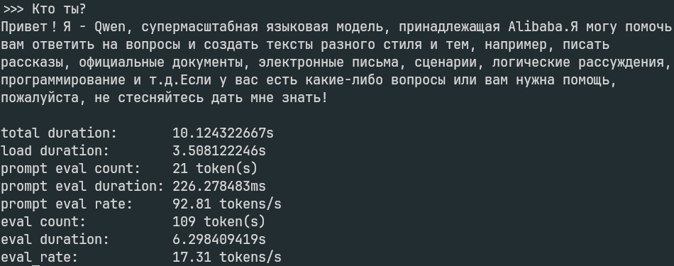
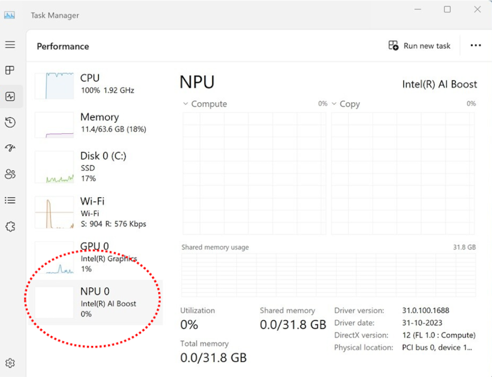

# Языковые модели с доступом к серверу по API
- OpenAI. ChatGPT (https://platform.openai.com/api-keys)
    - Доступ к API платный (хотя в веб-интерфейсе GPT4o доступен бесплатно)
    - Для получения ключа доступа требуется подтвердить номер телефона

# Запуск языковых моделей локально
Программы для работы с большими языковыми моделями (Large Language Models, LLM):
- скачивать модели (формат GGUF)
- запускать языковые модели локально
- предоставляет интерфейс чата для моделей
- ...

- **Jan** https://jan.ai/
- **LM Studio** https://lmstudio.ai/
- **Ollama**
- Llama.cpp (https://github.com/ggerganov/llama.cpp), производительнее чем ollama
- MLC (использует WebGPU)
- Transformers.js (запуск LLM в браузере)
- Candle (минималистичный) и другие

**Модели**
Модели, которые можно запускать на обычном ПК с 16-32 Гб  оперативной памяти - это модели до нескольких миллиардов параметров.
Обычно эти параметры ещё и квантизированы, т.е. вместо исходных типов данных float (16 или 32 бита) параметры хранятся в типах занимающих 8 или даже 4 бита. Это снижает точность модели, но более значимо снижение требований к оперативной памяти.


Ключевые характеристики модели обычно указываются в её названии, например модель `Llama-3 8B Q4` (Large Language Model Meta AI, появилась в апреле 2024) - это модель с 8 мла. параметров, каждый из которых занимает 4 бита. Файл такой модели (формата GGUF) занимает около 4.6 Гб.


ToDo: др. параметры генерации


**temperature** - параметр, отвечающий за уровень случайности в ответе модели. Обычно имеет значение от 0 до 1, но может быть и больше.
Небольшие значение (0 - 0.4) делают ответы более предсказуемыми. Значения от 0.8 и выше - модель выдаёт более свободные, креативные, не не обязательно точные ответы. 

todo: формула softmax с temperature

**Top-p** — параметр, определяющий количество токенов, из которых будет производится выбор при генерации ответа.
Это максимальная суммарная вероятность всех наиболее вероятных токенов.
Маленькие значения – более детерминированный ответ, большие (например 0.9) – более случайный.


# ollama


&nbsp;
    
- Имеет консольный интерфейс; для windows есть GUI
- Может скачивать файлы LLM из 
  - собственного репозитория (ollama.com) 
  - hugging face, если LLM записано в GGUF формате
- Работает как сервер, предоставляя доступ к моделям через OpenAPI (REST API по протоколу HTTP); API во многом похож на те, что используются в аналогичных серверах.
- Есть режим чата прямо в консоли 
- Может использовать GPU

Установка в Linux:
```bash
curl -fsSL https://ollama.com/install.sh | sh
```

Докер образ: https://hub.docker.com/r/ollama/ollama


**Пример запуска** (со скачиванием, если нужно) модели в консоли в режиме чата (зависит от модели)
```bash
ollama run qwen3:9b
```

`qwen3:9b` - название модели.

В Linux модели сохраняются в каталог `~/.ollama/models`


**Скачивание LLM**
```bash
ollama pull qwen3:9b
# скачивание с сайта hugging face
ollama ollama run hf.co/{username}/{repository}

ollama run hf.co/evgensoft/T-pro-it-1.0-Q4_K_M-GGUF

```


### Режим чата


### Запуск сервера

Ручной запуск сервера:
```bash
ollama serve
```
Проверить сервер можно по адресу: http://127.0.0.1:11434/

URL для обращения по REST API:
- http://localhost:11434/api/generate - ответ на промт
- http://localhost:11434/api/chat - режим чата
- http://localhost:11434/api/tags - доступные модели

Документация по API: https://github.com/ollama/ollama/blob/main/docs/api.md

Пакет для Python - обёртка над REST API Ollama: https://github.com/ollama/ollama-python

Модель, запущенная на сервере, не имеет состояния. Что типично для большинства LLM сервером. При обращении к LLM по API необходимо передавать весь необходимый контекст или историю чата.


**Настройка IP сервера**

По умолчанию Ollama запускается на lоcalhost:11434. Проверить адрес можно так: `ss -tuln | grep :11434`. 
Чтобы запустить ollama на всех интерфейсах (IP устройства) нужно:
Открыть редактор в конфигурации
```bash
sudo systemctl edit ollama.service
```
В файле задать:
```
[Service]
Environment="OLLAMA_HOST=0.0.0.0:11434"
```

Потребуется перезапуск сервера.

```bash
sudo systemctl restart ollama.service
```


**Остановка сервера (запущенного как сервис)**
```bash
systemctl stop ollama.service
```

**Проверка API:**
```bash
curl http://localhost:11434/api/generate -d '{"model": "llama2", "prompt": "Why is the sky blue?"}
```


**help**
<details>
 
```text
Usage:
  ollama [flags]
  ollama [command]

Available Commands:
  serve       Start ollama
  create      Create a model from a Modelfile
  show        Show information for a model
  run         Run a model
  pull        Pull a model from a registry
  push        Push a model to a registry
  list        List models
  ps          List running models
  cp          Copy a model
  rm          Remove a model
  help        Help about any command

Flags:
  -h, --help      help for ollama
  -v, --version   Show version information
```

</details>


**Просмотр запущенных моделей и используемых ресурсов**
```bash
ollama ps
```



Модель `qwen3.5:0.8b` полностью загружена в память видеокарты (100% GPU). Поэтому обращение к этой модели будет максимально быстрым на данной машине.

Одна часть слоёв модели `gemma4:e2b` загружены в оперативную память (65%), другая часть в память видеокарты (35%). 35% вычислений, необходимыми для ответа будут быстрыми. Но остальные 65% медленными. 

Также будет тратиться время на пересылку данных (контекста) между RAM и VRAM (видеопамятью), скорость шины PCI, через которую проходят данные обычно в разы меньше чем скорость шины между CPU и RAM. И на 1-2 порядка меньше чем скорость пересылки данных между GPU и VRAM. Задержка на пересылку данных будет существенной только при большом контексте.  


**Измерение скорость работы LLM и других параметров**

```bash
ollama run qwen3:8b --verbose
```



* total_duration — общее время выполнения запроса: загрузка модели, обработка запроса и генерацию ответа.
* load_duration — время загрузки модели в память. Обычно большое только при первом запросе или если модель выгружалась.
* prompt_eval_count — количество токенов во входном запросе (промте).
* prompt_eval_duration — время обработки входного запроса.
* prompt_eval_rate — скорость обработки входных токенов.
* eval_count — количество токенов, сгенерированных моделью в ответе.
* eval_duration — время генерации ответа. Без учёта загрузки модели и обработки prompt.
* **eval_rate** — скорость генерации токенов. Главный показатель производительности LLM.


#### Другие возможности

**Эмбеддинги текстов**
Ollama также поддерживает модели для создания эмбеддингов текстов: https://ollama.com/blog/embedding-models

Для этого используются специальные модели. Например:

```bash
ollama pull mxbai-embed-large
```

Доступ по REST API:
```bash
curl http://localhost:11434/api/embed -d '{
  "model": "mxbai-embed-large",
  "input": "Llamas are members of the camelid family"
}
```

**Вызов функций**\
https://ollama.com/blog/tool-support

Модели с такими возможностями в библиотеке ollama приведены с тегом `tools`.\
Такие модели обучены выдавать специальный JSON с описанием функции (например запрос на поиск в интернете или чтение из файла), которую можно вызывать. А во время работы, модели должен быть передан список доступных для вызова функций и их аргументов. 
Для каждого вызова функции создаётся свой обработчик.

Общий принцип полагается на серию из 2 запросов:
1. User prompt + functions ->  LLM
2. Обертка над моделью или промежуточная программа получает ответ модели: LLM -> 
  1. Обычный ответ. Обращения к функциям не требуется.
  1. function_call
3. Если модель выдала function_call:
  1. Обертка на LLM не выдаёт ответ пользователю, а вызывается соответствующую ответу модели функцию
  1. Получает результат. Подаёт новый запрос в LLM, с результатами работы функции.
  1. Получает ответ LLM
4. Ответ выдаётся пользователю или клиентской программе.

Обработка function_call может быть реализована на сервере, который выступает сосредником между пользователем и LLM.
Или же эта обработка может просходить на отдельном специальном сервере (возможно одним из многих). Такие сервера, фактически выполняющие fucntion calling называются MCP серверами. 
MCP - Model Context Protocol.


**Мультимодальные модели с поддержкой анализа изображений**\
https://ollama.com/blog/vision-models

Модели с такими возможностями в библиотеке ollama приведены с тегом `vision`.

```py
import ollama

res = ollama.chat(
	model="gemma3:4b",
	messages=[
		{
			'role': 'user',
			'content': 'Describe this image:',
			'images': ['./some-image.jpg']
		}
	]
)

# предполагается, что файл some-image.jpg находится в текущем каталоге; он будет отправлен модели автоматически 
print(res['message']['content'])

```


**Запуск с поддержкой ROCm для видеокарт от AMD**:

В новых версиях (начало 2026 года) есть экспериментальная поддержка ROCm, в том числе для видеокарт которые не официально поддерживают эту технологию.

Как правило, необходимые компоненты для ROCm Ollama скачивает при установке \ обновлении. Но для включения ROCm потребуется явно указать это в файле конфигурации. В Ubuntu удобнее всего отредактировать файл конфигурации так:
```bash
sudo systemctl edit ollama
```

Включить поддержку:
```
[Service]
Environment="OLLAMA_USE_ROCM=1"
```


***
При проблемах совместимости с аппаратным обеспечением (GPU не имеет полной поддержки ROCm) выполнение кода на GPU может быть возможным только после подмены переменной `HSA_OVERRIDE_GFX_VERSION=10.3.0` - версии графического ядра.
Подмена версии имеет смысл, если GPU фактически поддерживает ROCm, но в драйверах эта поддержка искусственно ограничена. Этот подход протестирован и срабатывает на Ubuntu 24.10 даже без установки официальных драйверов от AMD, только с драйверами по умолчанию.
Для использования GPU потребуется добавить текущего пользователя, который запускает ollama в группу render:
```bash
sudo usermod -a -G render $USER
```

Запсук на видеокарте:
```bash
OLLAMA_HOST="127.0.0.1:11434" HSA_OVERRIDE_GFX_VERSION=10.3.0 ollama serve
```


#### Запуск докер образа

**Первый запуск**
```bash
docker run -d --gpus=all -v ollama:/root/.ollama -p 11434:11434 --name ollama ollama/ollama
```
- `-d` запуск в режиме сервиса (демона, daemon)
- `--gpus=all` предоставить доступ к GPU
-  `-v ollama:/root/.ollama` - присоединение папок (volumes) к контейнеру внешняя_папка:папка в контейнере; по умолчанию ollama сохраняет модели в папку .ollama, которая находится в папке пользователя, от имени которого она запущена. Если не указать внешнюю папку, до все изменения в файловой системе контейнера будут сохраняться только до его перезапуска.
- `-p 11434:11434` - проброс портов внешний_порт:порт_контейнера
- `--name ollama` - название с которым запустится контейнер
- `ollama/ollama` - название образа (скачается при необходимости), на основе которого будет выполнятся контейнер

Такая команда запуска создаст контейнер с именем ollama, который в дальнейшем можно будет запускать не указывая дополнительные параметры:
```bash
docker start ollama
```

Проверить запущенные контейнеры:
```bash
docker ps
```

# llama.cpp
- Производительнее до двух раз по сравнению с Ollama
- Использует формат `ggml` для моделей
- Есть python-пакет
- Нет удобного встроенного способа скачивать модели, как у Ollama и др.

Работа с docker образом:
https://github.com/ggerganov/llama.cpp/blob/master/docs/docker.md


## UI / API для LLM
- [OpenWebUI](https://openwebui.com/) - веб-интерфейс для больших языковых моделей, похожий на UI для ChatGPT
- LM Studio и Jan уже предоставляют UI для обращения к моделям 
- [Anything LLM](https://anythingllm.com/) 


# Anything LLM
Возможности:
- интеграция с LLM по API (Ollama, OpenAI, Anthropic, Gemini, ... )
- Интерфейс чата для LLM\
  Загрузка файлов; загрузка файлов, которые будут использоваться как контекст чата; команды (заранее созданный промпт); обращение к агентам; голосовой ввод и озвучивание ответов
- Предоставление API с настроенными чатами, предоставление встраиваемого веб-интерфейса на основе JS
- Использование поисковых систем совместно с LLM  (Google, Bing, ...)
- Взаимодействие с векторными БД (по умолчанию поставляется с LanceDB)
- Взаимодействие с инструментами для разбивки текстов на части 
- Сервис для суммаризации документов
- Test-to-speech и Speech-to-text
- ...


Инструкция для docker: https://github.com/Mintplex-Labs/anything-llm/blob/master/docker/HOW_TO_USE_DOCKER.md
**Установка**
```bash
docker pull mintplexlabs/anythingllm
```

**Запуск, Linux**
```bash
export STORAGE_LOCATION=$HOME/anythingllm && \
mkdir -p $STORAGE_LOCATION && \
touch "$STORAGE_LOCATION/.env" && \
docker run -d -p 3001:3001 \
--cap-add SYS_ADMIN \
-v ${STORAGE_LOCATION}:/app/server/storage \
-v ${STORAGE_LOCATION}/.env:/app/server/.env \
-e STORAGE_DIR="/app/server/storage" \
mintplexlabs/anythingllm
```

Сервер будет доступен на порту 3001.


# Выбор LLM


Рассмотрим несколько конфигураций компьютеров и дадим рекомендации по использованию LLM.

### Конфигурация 1. Только CPU

* Попробуйте различные модели, начиная с 1B–8B параметров. 
* Берите модели агрессивным квантованием (Q4, иногда Q3).
* Следите, чтобы модель помещалась в оперативную память с запасом.
* Предпочитайте модели типа Mixture Of Experts (смесь экспертов). В таких моделях активируются не все блоки нейросети, а только некоторые. Это ускоряет их работу.
* 
Если при генерации память заполнена или скорость ответа очень маленькая, при нагрузке CPU 100%, то пробуйте более маленькие модели, более жёсткое квантование или меньший контекст.

### Конфигурация 2. CPU с NPU

* Требования по памяти аналогичны предыдущей конфигурации.
* Если память позволяет, то берите относительно компактные модели (7B–14B) в низкой разрядности (INT8/FP16). 
* Рассмотрите специально оптимизированные под NPU/мобильные модели (часто помечены как mobile, efficient, int8‑optimized) почти всегда дадут лучший баланс скорость/качество, чем обычная модель того же размера. Но таких моделей довольно мало.

&nbsp;

**NPU (Neural Processing Unit)** — это специализированное устройство, оптимизированное для вычислений связанных с нейросетями. NPU обычно является часть процессора (CPU). В отдельных случаях, некоторые производители могут в маркетинговых целях использовать другие названия для NPU.

Наличие NPU можно проверить в Диспетчере задач Windows.



&nbsp;

В отличие от классического CPU, NPU заточен именно под массовые параллельные умножения и сложения с малой разрядностью чисел. Например для чисел которые занимают 16 или 8 бит памяти: INT8, FP16. Процессор (CPU) – более универсальное устройство и хуже подходит для массовых параллельных вычислений.


TOPS (Tera Operations Per Second) — это показатель вычислительной мощности, который обозначает количество триллионов (10^12) операций, выполняемых устройством за секунду. Обычно под «операциями» понимают целочисленные (INT8 и подобные) математические операции, широко используемые в нейросетях для ускорения инференса.

Этот показатель чаще всего характеризует именно NPU, которые оптимизированы для именно таких операций с нейросетями и искусственным интеллектом.


Скорость работы зависит от того, умеет ли текущая версия LM Studio, ollama или другой LLM сервер использовать конкретную модель NPU. Поддержка NPU пока фрагментарная и обычно завязана на конкретные платформы (например, Apple Silicon, некоторые ARM/Windows‑устройства). Но общая логика такая:

Если поддержка заявлена, LM Studio обычно либо автоматически использует NPU..

Если есть выбор бэкенда (CPU / GPU / NPU), начинайте со смешанного или NPU‑ориентированного варианта и сравните скорость/стабильность с CPU. На NPU имеет смысл пробовать чуть более крупные модели (например, те, что на CPU были медленными). Всё равно следите за загрузкой оперативной памяти в диспетчере задач.


Специально оптимизированные под **NPU/мобильные модели** (часто помечены как mobile, efficient, int8‑optimized) почти всегда дадут лучший баланс скорость/качество, чем обычная модель того же размера.

Даже при наличии NPU часть логики (декодирование токенов, управление, иногда часть слоёв) может выполняться на CPU, поэтому быстрый и многопоточный CPU всё равно полезен. Если система при этом остаётся отзывчивой, можно чуть увеличить контекст или max tokens. NPU обычно повышает производительность на токен.

В идеальном варианте скорость работы LLM будет близка к бюджетной или средне бюджетной игровой видеокарте GPU.

Иногда выигрыш от использования CPU есть только на определённых LLM с определённым квантованием.


### Конфигурация 3. GPU

* Выбирайте модели, которые поместятся в память видеоркарты (VRAM) с запасом


Если модель помещается в VRAM не полностью, то это может кратно замедлить работу модели.

Использование GPU (видеокарты) – в общем случае наиболее выигрышный вариант для запуска LLM. Так как видеокарты изначально предназначены для массовых параллельных вычислений, а современные видеокарты обычно создаются и с расчётом на то, что они будут использованы для использования и обучения нейросетей.

Разница может достигать 10–100 раз в зависимости от размера модели и конкретного устройства.

Nvidia — лидеры в области создания GPU для ИИ. Благодаря технологии CUDA (Compute Unified Device Architecture), которая позволяет использовать GPU для вычислений, а не только для графики. Большинство современных программ для ИИ и моделей оптимизированы именно под CUDA.

AMD — поддержка ИИ в устройствах расширяется, но пока уступает Nvidia по популярности программных инструментов. В 2025 году появились проекты, которые начали поддерживать AMD GPU через технологии ROCm (своего рода аналог CUDA), но они всё ещё менее распространены и могут требовать ручной настройки.

Для использования возможностей GPU нужно установить последние драйверы с сайта Nvidia или AMD (официальные версии). Для Nvidia дополнительно рекомендуется установить CUDA Toolkit.
