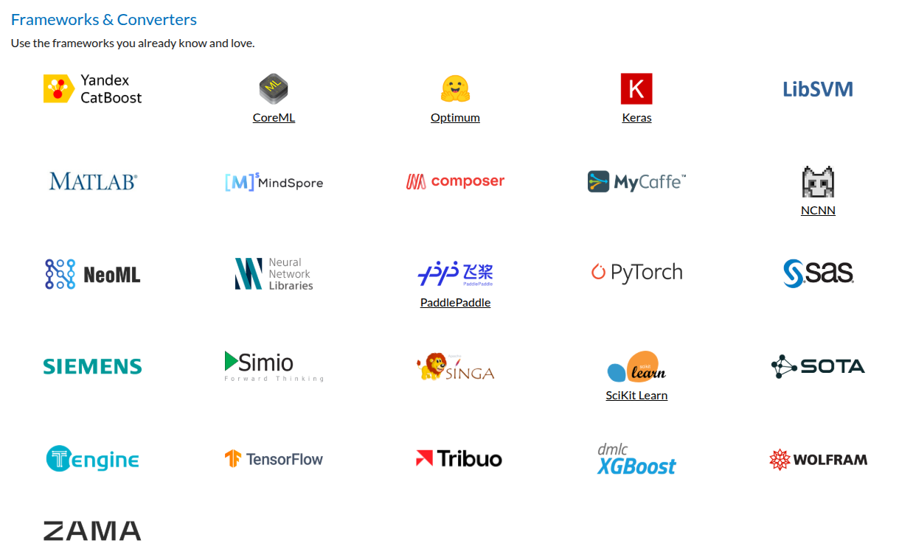
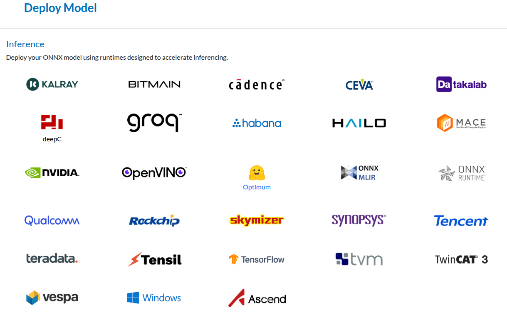

# Сохранение моделей МО

### Зачем сохранять?
- Обычно обучение моделей происходит на одной машине, а использование на отдельной или на нескольких
- Модели могут обучаться долго, даже если они используются на той же машине, имеет смысл сохранить их чтобы снова не тратить время на обучение
- Нужно хранить различные версии или конфигурации моделей, который обучены по разному, работают с разным набором признаков.
- Некоторые модели (например нейросети) можно обучать итеративно, поэтому имеет смысл сохранять их периодически или сохранять для последующего дообучения

### Способы сохранения
Способы сохранения моделей МО по сохраняемым данным:
- **Сохранение состояния или параметров**
  Например только коэффициенты уравнения линейной регрессии или только веса (параметры) нейросети.\
  Файл не привязан к конкретному языку программирования, слабо привязан или не привязан к версии библиотеки.
- Параметры + конфигурация/архитектура;
- **снимок объекта Python**.
  Обычно сохраняется объект модели МО, например переменная типа LinearRegression из sklearn.\
  Сохранение обычно происходит в бинарный файл.\
  Для успешной загрузки нужно знать версию библиотеки для сохранения, версию библиотеки в которой создана моделей. Например joblib\pickle и sklearn.\
  Есть риск выполнения произвольного кода при загрузке (десеареализации) бинарного объекта из файла. 
- **код графа/модели для исполнения**.
  Сохраняется не код на Питоне, описание вычислений. Безопасно для исполнения.

Способы сохранения моделей МО по виду файла
- **Текстовый файл**. Данные в произвольном формате, JSON и др. текстовые форматы.
- **Бинарный файл**. 


## Сохранение в различных библиотеках
### Scikit-learn и др. пакеты

**Scikit-learn**
- `pickle` -- удобный встроенный пакет для сохранения моделей.
- `joblib` обычно удобнее для объектов с большими массивами

Это Python-специфичные решения. Для загрузки нужен совместимый Python-стек, и при смене версии scikit-learn может всплывать несовместимость.


**XGBoost**
- `save_model("model.json")`
- `save_model("model.ubj")` - сохранение в UBJSON (Universal Binary JSON )
- Можно использовать joblib или pickle, но это обычно удобнее для сохранения промежуточного состояния модели, когда нужно позднее продолжить обучение.


**LightGBM**\
- `Booster.save_model("model.txt")`
- `Booster(model_file="model.txt")`

**CatBoost**
Основной формат cbm; дополнительно есть экспорт в json, coreml, onnx, а также в python

### PyTorch
Cохранять `state_dict` через `torch.save(...)` и потом восстанавливать его в той же архитектуре. Для инференса (использования, не обучения) обычно ещё переводят модель в режим `model.eval()`.
Сохранение всего объекта `torch.save(model, ...)` тоже работает, но оно опирается на pickle и жёстко привязано к коду классов и структуре проекта, поэтому для переноса между машинами и версиями это хуже. Обычно используются расширения файлов .pt и .pth.

### Hugging Face/Transformers.
`save_pretrained()` и `from_pretrained()`. Модель сохраняется в директорию, из которой потом можно снова загрузить веса и конфигурацию. Это удобно для сервера, другой машины и для повторного использования без ручной сборки объекта


### ***
См. функции для сохранения и загрузки моделей в других пакетах.

Записывайте в имя файла или в отдельный файл информации о версиях библиотек и другую важную информацию, которая может повлиять на загрузку модели в том или ином виде.


# ONNX

https://onnx.ai/

**ONNX**, или **Open Neural Network Exchange** — это открытый формат для представления моделей машинного обучения в виде *графа вычислений*. Внутри модель описывается не как Python-объект, а как набор входов, выходов, узлов (описывают математические операции) и параметров. Поэтому ONNX удобен именно как переносимый формат. Одну и ту же модель можно загрузить и запускать в разных средах и на разных платформах. Даже простая линейная регрессия в ONNX выражается через обычные операции вроде умножения матриц и сложения.

Для конвертации модели в ONNX формат требуется специальный конвертер. Это различные пакеты разработанные для различных моделей.

Для запуска моделей требуется исполняемая среда — ONNX runtime. Для питона она представлена отдельным пакетом. Но ONNX модели можно запускать и с помощью других языков.


Для успешного запуска необходимо, чтобы поддерживаемый набор команд (opset, operations set) при конвертации и при запуске был одинаковый.


    




https://onnx.ai/supported-tools.html


**Конвертирование в ONNX формат**
https://github.com/onnx/tutorials?tab=readme-ov-file#converting-to-onnx-format


## ONNX и классические модели МО

Для scikit-learn есть отдельный набор конвертеров, прежде всего `sklearn-onnx`, который переводит предсказательную часть модели в ONNX-граф. В документации прямо сказано, что он переписывает функцию предсказания через ONNX-операторы. Поддерживается много классических моделей и пайплайнов, но не все. Если в модели есть нестандартные шаги, может понадобиться отдельный конвертер или ручная доработка. Для части традиционных алгоритмов используется расширение ONNX-ML, которое как раз добавляет классические алгоритмы машинного обучения, не только нейросети.

В ONNX обычно хорошо переводятся линейные модели, многие деревья решений, некоторые варианты бустинга, препроцессинг и целые пайплайны. Конвертация зависит от того, есть ли для нужных операций поддержка в ONNX и в конкретном конвертере.

https://onnx.ai/sklearn-onnx/index.html


```py
from skl2onnx import __max_supported_opset__, __version__

print("documentation for version:", __version__)
print("Last supported opset:", __max_supported_opset__)


```

## ONNX и PyTorch

У PyTorch есть встроенный экспорт в ONNX: модуль `torch.onnx` берёт вычислительный граф модели `torch.nn.Module` и преобразует его в ONNX-граф. Это как раз один из самых типичных сценариев применения ONNX в практике. В современных версиях PyTorch экспорт идёт через новый механизм, основанный на `torch.export`, а не только через старый путь. 

Но здесь важно помнить об ограничениях. Не вся логика Python автоматически превращается в ONNX. Например, сложные управляющие конструкции и условная логика могут потребовать переработки модели, потому что ONNX ожидает не произвольный Python-код, а граф вычислений из поддерживаемых операторов. Это хороший формат для вывода модели на сервере или в отдельный рантайм, но не универсальная замена исходному PyTorch-коду. 


## ONNX и Keras\TensorFlow

С Keras тоже можно работать через ONNX. Экспорт модели в ONNX через `model.export(..., format="onnx")`, после чего модель можно загрузить в `onnxruntime.InferenceSession`. Это удобный путь, если модель обучалась в Keras, а запускать её нужно отдельно от Python-окружения или в другой инфраструктуре.

Если смотреть шире на TensorFlow/Keras, то ONNX здесь тоже выступает как формат для переноса вычислительного графа и весов, а не как контейнер для исходного кода. Практически это означает, что простые и стандартные архитектуры обычно экспортируются нормально, а вот кастомные слои, нестандартные функции и редкие операции могут потребовать дополнительных усилий. Это уже следует из самой природы ONNX: он поддерживает ограниченный набор операторов и версий opset, которые со временем расширяются. 

## ***

Главная сила ONNX в том, что он отделяет модель от конкретного языка и от конкретной библиотеки обучения. Модель можно обучить в scikit-learn, PyTorch или Keras, а потом запускать в отдельной среде, например через ONNX Runtime. Это особенно удобно для серверов, микросервисов и случаев, когда Python на стороне инференса не нужен. 

Ещё одна важная деталь — версии. У ONNX есть IR version и opset version, и именно они задают, какие операторы доступны и как интерпретируется граф. Поэтому при переносе модели важно смотреть не только на сам файл, но и на совместимость конвертера, opset и runtime. ([ONNX][7])


# Безопасность
Файл с моделью — это не просто данные, а потенциально исполняемый payload. Соответственно, основной риск — это выполнение произвольного кода (RCE, Remote Code Execution) при загрузке.

Главое правило простое: никогда не загружайте .pkl или .joblib из недоверенных источников.

Если по каким-то причинам всё же нужно загрузить такой файл, делайте это только в изолированной среде, в песоцнице. В Docker-контейнере или виртуальной машине, без доступа к сети и файловой системе, и желательно от имени отдельного пользователя.

Важно понимать, что надёжно проверить pickle-файл на безопасность невозможно. Причина в том, что это не просто данные, а сериализованная программа. Можно разобрать содержимое, например через pickletools.dis, или попытаться найти подозрительные вызовы вроде os.system или eval, но это не даёт никаких гарантий безопасности.

# См. также
- Пример создания docker контейнера
  - examples/docker-api
  - examples/docker-ML-web
