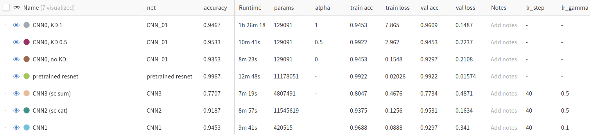
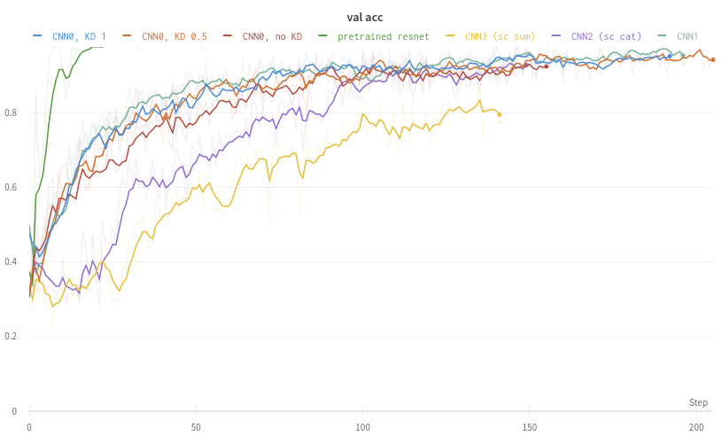
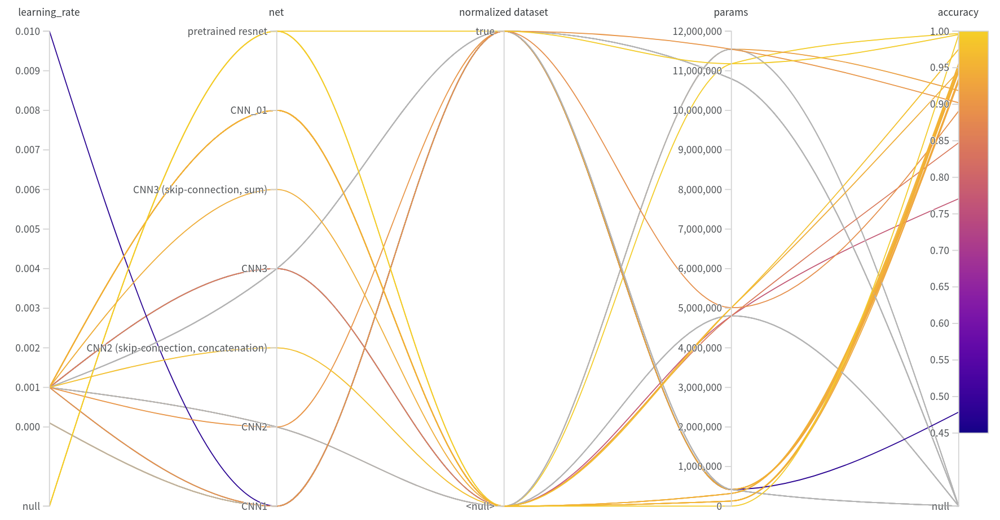

# wandb. weights and biases

Библиотека и сервис для сбора информации о обучении моделей

- логирование на сервис в реальном времени для построению кривых обучение
- сбор информации об отдельных запусках моделей с отображением статистики и произвольной модели
- различные визуализации


1. Зарегестрироваться в https://wandb.ai/

2. Создать проект в котором будут собрана вся нформациия о моделях и их запусках

3. Установить библиотеку

```python
%%capture
!pip install wandb -qqq
import wandb
```

4. Подключится для удалённого логирования

`!wandb login`

5. Инициализировать сессию для загрузки информации об отдельном запуске обучения модели
```python
wandb.init(project="project name",   # один проект на много запусков
           config={                   # словарь с описанием текущего запуска. ключи -- произвольные
    "learning_rate": 1e-3,
    "net": "CNN3 (skip-connection, sum)",
    "params": sum(p.numel() for p in my_model.parameters() if p.requires_grad)      # подсчёт числа параметров модели
})
```
В словарь стоит записывать все основные гиперпараметры модели и параметры процесса обучения:
- название сети (описание её архитектуры, число слоёв, число нейронов, функции активации, ... )
  - веса можно сохранить отдельно
  - число параметров можно подсчитывать автоматически
- метод оптимизации весов (если меняется)
- функцию потерь
- learning rate и параметры его изменения
- информация о обучающей выборке: размер батча, аугментация, способы предобработки


После нескольких запусков функции init можно получить таблицу вида:\
\


6. Сохранить модель на сервере wandb
```
    # WandB – Save the model checkpoint. This automatically saves a file to the cloud and associates it with the current run.
    torch.save(model.state_dict(), "model.h5")
    wandb.save('model.h5')
```


6. Логировать серийную информацию во время обучения. Автоматически будут построены кривые обучения (здесь функции потерь и общей точности) на странице проекта. Эти кривые будут обновлятся по мере добавления данных
```
wandb.log({"train loss":loss.item(), "train acc":AccTrain[-1], "val loss":loss_val.item(), "val acc":AccVal[-1]})
```
Пример графиков\

Здесь видно как обучались разные модели с разными параметрами

Можно сохранять в том числе изображения (pytorch Images). По одному или все разом:
```python
wandb.log({"val\test misprediction" : [wandb.Image(img) for img in mispredicted]})
```

7. Сохранить не серийную информацию, результаты обучения:

```python
# после обучения можно в текущий запуск записать конечные параметры
wandb.run.summary['accuracy'] =  accuracy_score(ytest, ypred)
wandb.run.summary['f1'] =  f1_score(ytest, ypred)
```

8. Один Сеанс (Run) завершится автоматически, как только будет снова вызвано `wandb.init`. Но можно завершить вручную
```python
wandb.sdk.wandb_run.finish()
```
Обычно завершение одного Cенаса (Run) занимает какое-то время.

После сбора информации об отдельных Сеансах составляется отчёт, который включает кривые обучения и диаграмму влияния параметров на конечный результат. Например\

